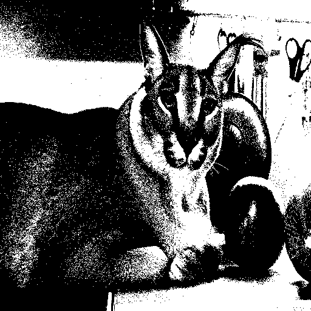
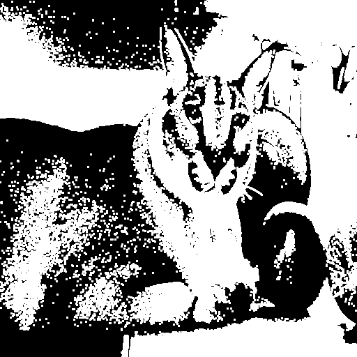
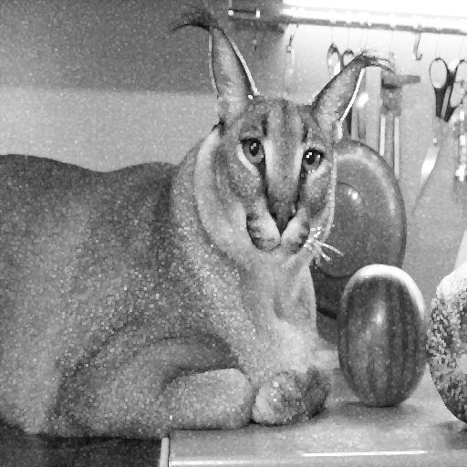

Отчет по лабораторной работе №1  
Вариант №6  
ТЗ:  
Дилатация, примитив размера 3 на 3, бинаризацию можно не
реализовывать вручную.  
Принцип работы:
1) Добавление нулевого паддинга для обработки границ 
2) Последовательное применение скользящего окна 3×3 
3) Вычисление максимума для каждой позиции окна
4) Запись результата в выходное изображение

Входное изображение:    
  
Дилатация opencv:  
  
Дилатация нативная:   
  

Время выполенения:  
OpenCV dilation: 0.000147 ± 0.000034 sec  
Native dilation: 0.915001 ± 0.028773 sec  
Также была посчитана разница между выходными фотографиями, попиксельно:  
diff by methods: 0

Вывод:
В ходе работы был реализована функция дилатации. Проведены тесты по скорости. Реализация opencv выигрывает в 10000 раз.

Источники:
1) https://opencv.org/
2) https://chat.deepseek.com