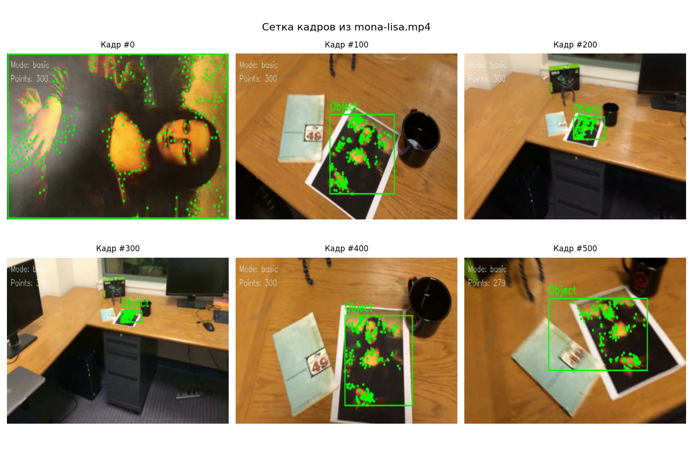
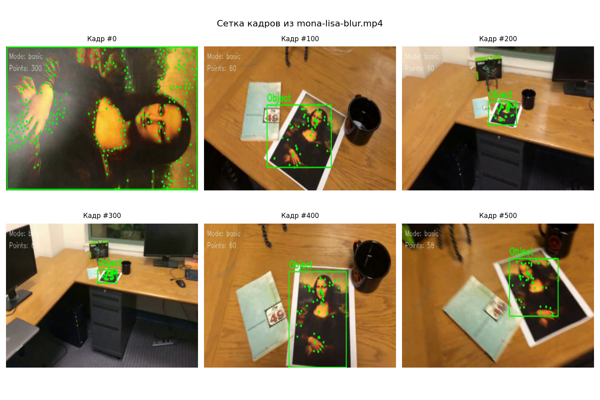
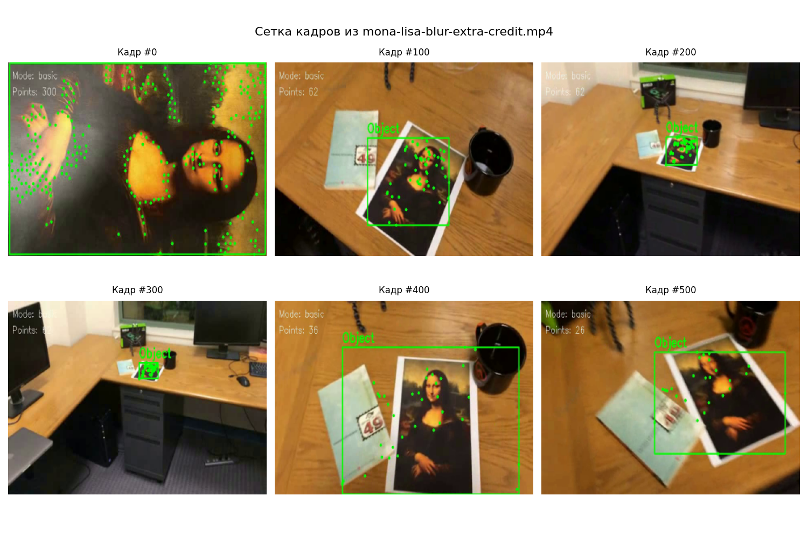
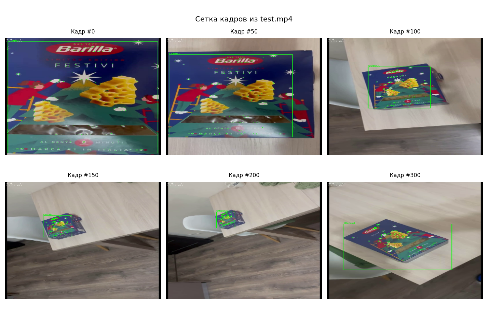

# Отчет по Лабораторной работе №2: Трекинг объекта на видео с использованием KLT

## Краткое описание

В рамках работы реализован трекинг объекта на видео с использованием оптического потока Лукаса–Канаде (функция `calcOpticalFlowPyrLK` в OpenCV) и детектора ключевых точек Shi–Tomasi (функция `goodFeaturesToTrack` в OpenCV). Алгоритм отслеживает набор характерных точек на объекте и по их положению строит ограничивающий прямоугольник (bounding box).

---

## 1. Теоретическая база

### 1.1. Оптический поток и метод Лукаса–Канаде

**Оптический поток** — это векторное поле, описывающее кажущееся движение точек изображения между соседними кадрами видео. Основная предпосылка (brightness constancy constraint) заключается в том, что яркость пикселя при малом временном сдвиге сохраняется:

$$I(x, y, t) = I(x + \delta x, y + \delta y, t + \delta t)$$

Разлагая правую часть в ряд Тейлора первого порядка и отбрасывая старшие члены, получаем уравнение оптического потока:

$$I_x u + I_y v + I_t = 0$$

где:
- $(I_x, I_y$) — частные производные яркости по координатам (градиент изображения)
- $(I_t$) — производная яркости по времени между кадрами
- $(u, v$) — компоненты вектора скорости (оптического потока)

Это уравнение является недоопределенным (одна связь на две неизвестные), что составляет **проблему диафрагмы** (aperture problem).

### 1.2. Метод Лукаса–Канаде

Метод Лукаса–Канаде решает проблему диафрагмы, вводя локальное предположение о **постоянстве движения** в малой окрестности $\Omega$ радиусом k вокруг анализируемой точки.

Для всех пикселей в окне предполагается один и тот же вектор движения $[u, v]$. Система переопределяется и решается в смысле наименьших квадратов:

$$\begin{bmatrix} I_x & I_y \end{bmatrix} \begin{bmatrix} u \\ v \end{bmatrix} = -I_t$$

для каждого пикселя в окне. Решение находится через нормальные уравнения:

$$\begin{bmatrix} \sum I_x^2 & \sum I_x I_y \\ \sum I_x I_y & \sum I_y^2 \end{bmatrix} \begin{bmatrix} u \\ v \end{bmatrix} = - \begin{bmatrix} \sum I_x I_t \\ \sum I_y I_t \end{bmatrix}$$

Матрица структурного тензора:

$$G = \begin{bmatrix} \sum_{(x,y)\in\Omega} I_x^2 & \sum_{(x,y)\in\Omega} I_x I_y \\ \sum_{(x,y)\in\Omega} I_x I_y & \sum_{(x,y)\in\Omega} I_y^2 \end{bmatrix}$$

должна быть хорошо обусловленной (иметь большие и сравнимые собственные значения) для устойчивого решения. Это выполняется в точках с выраженными изменениями яркости по двум направлениям (такие точки называются **хорошими для трекинга**).

### 1.3. Детектор особенностей Shi–Tomasi

Для надежного применения метода Лукаса–Канаде необходимо выбирать точки, в окрестности которых матрица \(G\) имеет благоприятные свойства. В детекторе Shi–Tomasi качество точки определяется по минимальному собственному значению:

$$R = \min(\lambda_1, \lambda_2)$$

где $(\lambda_1, \lambda_2$) — собственные значения матрицы структурного тензора. Точка отбирается, если её качество превышает порог, пропорциональный максимальному качеству во всем изображении.

**Функция `cv2.goodFeaturesToTrack`** реализует именно этот детектор. Параметры:
- `maxCorners` — максимальное количество выделяемых точек
- `qualityLevel` — доля от максимального R, ниже которого точки отбрасываются
- `minDistance` — минимальное расстояние между центрами выделяемых точек
- `blockSize` — размер блока (окна) для расчета матрицы G

### 1.4. Пирамидальный оптический поток

При больших смещениях объектов (более чем на несколько пикселей) локальное предположение метода Лукаса–Канаде может нарушаться. Для обхода этого ограничения используется **пирамида изображений** (image pyramid):

**Построение пирамиды:**
1. Уровень 0 — исходное изображение размером $(W \times H$)
2. Уровень 1 — изображение размером $(W/2 \times H/2$) (уменьшено в 2 раза)
3. Уровень 2 — изображение размером $(W/4 \times H/4$)
4. Уровень $(L$) — размер $(W/2^L \times H/2^L$)

**Итеративное вычисление:**
1. На самом грубом уровне смещения между кадрами становятся относительно меньшими в пикселях, что упрощает расчет.
2. Вычисленное смещение на уровне \(L\) масштабируется в 2 раза и используется как начальное приближение на уровне \(L-1\).
3. На уровне \(L-1\) метод Лукаса–Канаде уточняет это смещение (обычно несколькими итерациями).
4. Процесс повторяется до достижения исходного разрешения (уровень 0).

Такой подход объединяет грубый поиск (быстро, большой радиус поиска) с точным уточнением (медленнее, но более точно).

В **`cv2.calcOpticalFlowPyrLK`** пирамидальный подход управляется параметрами:
- `winSize` — размер окна для локальной оценки движения на исходном разрешении
- `maxLevel` — максимальный номер уровня пирамиды (например, maxLevel=3 означает уровни 0, 1, 2, 3)
- `criteria` — критерий останова (максимум итераций и точность)

---

## 2. Описание разработанной системы

### 2.1. Алгоритмы

Программа реализует две ключевые техники:

1. **Метод Лукаса–Канаде для оптического потока (`cv2.calcOpticalFlowPyrLK`)**
   - Отслеживание движения ключевых точек между кадрами
   - Использование пирамидального подхода для обработки больших смещений
   - Локальная оценка движения в окне размером 21×21 пикселей

2. **Детектор Shi–Tomasi для выделения ключевых точек (`cv2.goodFeaturesToTrack`)**
   - Выбор наиболее информативных точек на основе собственных значений
   - Начальное заполнение точками на первом кадре

### 2.2 Архитектура системы

Система состоит из классов [KLTTracker](/source/klt_tracker.py), [VideoReader/VideoWriter](/source/video_io.py), [FrameVisualizer](/source/visualizer.py) и основной функции [main](/source/main.py).

**Основные компоненты:**

- **`video_io.py`: `VideoReader` / `VideoWriter`**
  - `VideoReader.__init__(videopath)`: инициализация VideoCapture, получение FPS
  - `VideoReader.read_first_frame()`: чтение первого кадра (с ошибкой при неудаче)
  - `VideoReader.read_next_frame()`: чтение следующего кадра (ret, frame)
  - `VideoReader.release()`: освобождение VideoCapture
  - `VideoWriter.__init__(outputpath, frameshape, fps)`: создание VideoWriter (MP4V кодек)
  - `VideoWriter.write_frame(frame)`: запись кадра
  - `VideoWriter.release()`: освобождение VideoWriter

- **`klt_tracker.py`: `KLTTracker`**
  - `__init__(frameshape, mode=BASIC, min_points_threshold=50, reinitialize_ratio=0.3)`: настройка параметров (feature/lk params, пороги)
  - `initialize_tracking(first_gray_frame)`: поиск goodFeaturesToTrack на первом кадре, сохранение initial_points_count
  - `track_next_frame(frame_gray)`: calcOpticalFlowPyrLK, проверка потерь точек
  - `get_bbox(points=None)`: вычисление bounding box из точек (или current_bbox)
  - `get_current_points_count()`: текущее количество точек
  - `get_status_info()`: статус (mode, points_count, skipped, initial_points_count)

- **`visualizer.py`: `FrameVisualizer`**
  - `__init__(window_name="KLT tracking")`: создание окна визуализации
  - `draw_tracking(frame, points, bbox, status_info)`: рисование точек (круги), bbox (прямоугольник), текста (Object, Mode/Points/NewPoints)
  - `show_frame(frame)`: отображение кадра (с waitKey)
  - `cleanup()`: destroyAllWindows

- **`main.py`: `main(mode)`**
  - оркестрация: чтение видео → init tracker → while loop (track → visualize → write/show) → cleanup

**Вход:** видеофайл (`test-videos/test.mp4`), размер кадра, режим трекинга (`BASIC`/`SKIP`)  
**Выход:** аннотированное видео (`outputklt.mp4`), визуализация в реальном времени

### 2.3. Параметры алгоритмов

**Параметры инициализации:**
- `maxCorners=300` — максимум 300 ключевых точек на первом кадре
- `qualityLevel=0.01` — отбирать точки качества ≥ 1% от максимального
- `minDistance=15` — минимальное расстояние между точками 15 пикселей
- `blockSize=30` — размер блока для анализа градиентов

**Параметры оптического потока:**
- `winSize=(21, 21)` — окно 21×21 пикселя для локальной оценки
- `maxLevel=3` — использовать пирамиду до уровня 3 (размеры: 1, 1/2, 1/4, 1/8)
- `maxIterations=30` — максимум 30 итераций уточнения на каждом уровне
- `epsilon=0.01` — критерий останова по ошибке

---

## 3. Тестирование

Тестирование проводилось на тестовых файлах:

  1. `test-videos/mona-lisa.avi` - Обычное видео без эффектов 
  2. `test-videos/mona-lisa-blur.avi` - Видео из 1 теста с эффектом blur в начале записи.
  3. `test-videos/mona-lisa-blur-extra-credit.avi` - Видео из 2 теста с добавленим еще одного blur ближе к концу записи.
  4. `test-videos/test.mp4` - Лично записанное видео.

### 3.1. mona-lisa

  Алгоритм успешно отслеживает изображение на видео, точки не теряются, за исключением небольшого процента в конце, при навлоне камеры.

  

### 3.2 mona-lisa-blur
  Алгоритм потерял большую часть точек после blur, но оставшиеся точки в достаточном объеме описывают объект и успешно отслеживаются до конца записи.

  

### 3.3 mona-lisa-blur-extra-credit
  Алгоритм также потерял большую часть точек после первого blur, но объект можно было продолжать отслеживать. При втором blur эффекте снова произошла значительная потеря точек, а также точки вылезли за границы объекта, после чего отслеживание объекта перестало отражать действительность.

  

### 3.4 Лично записанное видео
  Алгоритм успешно отслеживает объект на видео, таким образом подтверждая корректную реализацию и обеспечивая надежную работу на текстурных объектах с умеренным движением.

  

## 5. Выводы по работе

**Эффективность алгоритма:**

Реализованный алгоритм успешно отслеживает объекты на видео, обеспечивая надежную работу на текстурных объектах с умеренным движением. Пирамидальный оптический поток позволяет обрабатывать смещения до нескольких десятков пикселей, однако при резких смещениях и изменениях изображения, алгоритм может потерять объект.

## 6. Использованные источники

1. OpenCV Documentation: Optical Flow — https://docs.opencv.org/master/dc/d6b/group__video__track.html
2. Lucas, B. D., & Kanade, T. (1981). "An iterative image registration technique with an application to stereo vision". Proceedings of IJCAI, 674-679.
3. Shi, J., & Tomasi, C. (1994). "Good Features to Track". Proceedings of CVPR, 593-600.
4. Bouguet, J. Y. (1999). "Pyramidal implementation of the Lucas Kanade feature tracker". Intel Technical Report.
