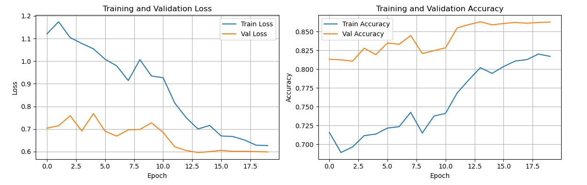

Отчет по лабораторной работе №3  
Вариант №1  
ТЗ:
1. Выбрать цель для задачи классификации и датасет (train/val: собрать либо найти,
например, на Kaggle, test: собрать, разметить, не менее 50 изображений).
2. Зафиксировать архитектуру сети, loss, метрики качества.
3. Натренировать (либо дотренировать сеть) на выбранном датасете
4. Оценить качество работы по выбранной метрике на валидационной выборке,
определить, не переобучилась ли модель.
5. Сделать отчёт в виде readme на GitHub, там же должен быть выложен исходный код.

БАЗА:

Описание системы:
Выбрали датасет: https://www.kaggle.com/datasets/trolukovich/food11-image-dataset   
Классификация на 11 классов.  
Дообучили VGG-11

Результаты:

accuracy on dessert: 0.8  
accuracy on seafood: 0.33  
accuracy on bread: 0.67  
accuracy on egg: 0.5  
accuracy on meat: 1.0  
accuracy on rice: 0.6  

Вывод:  
В ходе работы была дообучена модель VGG-11 c измененным выходным слоем.  
Доля правильных ответов на обучающей/валидационной выборках: 0.81/0.86.  
Вручную собранные данные модель размечает с общей долей правильных ответов: 0.65.  